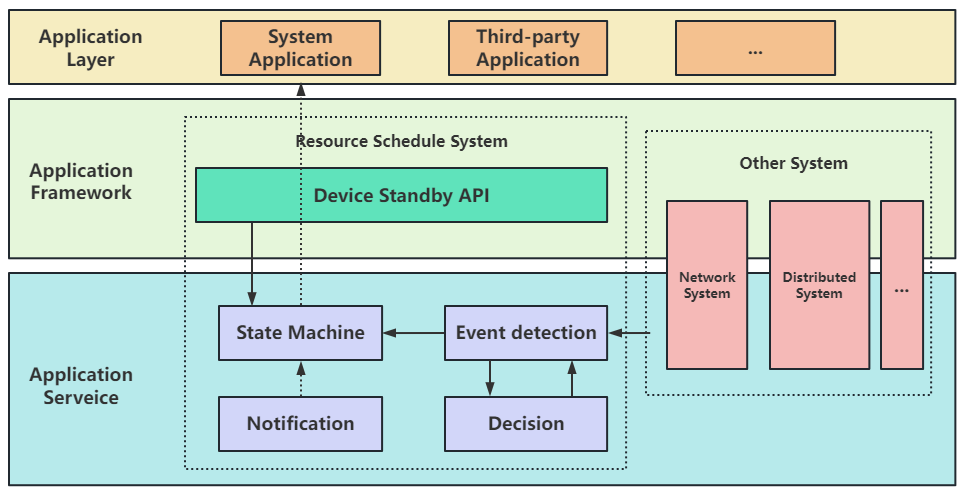

# Device Standby
## Introduction<a name="section11660541593"></a>
To improve device endurance and reduce device power consumption, the system will limit the use of resources by backend applications when the device enters a standby idle state. Developers can apply for inclusion in standby resource control for their applications based on their own situation, or temporarily not be controlled by standby resources.

**Image 1**  Device Standby system structure



## Directory Structure<a name="section161941989596"></a>

```
/foundation/resourceschedule/device_standby
├── frameworks       # API interface
├── interfaces
│   ├── innerkits    # inside interface
│   └── kits         # outside interface
├── sa_profile       # component service configruation
├── services         # service implements
└── utils            # commone utils
└── plugins          # plugins（state detection、decision、transition、exection）
└── bundle.json      # component discription and build file
```

### Inner Module Introduction<a name="section114564657874"></a>

|Module Name   |Discription    |
|------------|---------------|
|interface   |1.provide inner dump function, exemption, notification interfaces. |
|            |2.provide constraint interfaces. |
|sa_profile  |config standby service in service management.|
|services    |1.core services implements. |
|            |2.notification, search function. |
|plugins     |1.status detection. |
|            |2.limit application source decision.| 
|            |3.change device status.  |
|            |4.execte strategy|
|utils       |1.common tools, log ability|
|            |2.reference configuration |
|frameworks  |provide Apis.|

## Device Standby<a name="section1312121216216"></a>

|Interface   |Discription    |
|------------|---------------|
|function getExemptedApps(resourceTypes: number, callback: AsyncCallback<Array&lt;ExemptedAppInfo&gt;>): void; |Returns the information about the specified exempted application. |
|function getExemptedApps(resourceTypes: number): Promise<Array&lt;ExemptedAppInfo&gt;>; |Returns the information about the specified exempted application. |
|function requestExemptionResource(request: ResourceRequest): void; |Requests exemption resources.|
|function releaseExemptionResource(request: ResourceRequest): void; |Releases exemption resources.|

## Usage Guidelines<a name="section114564657874"></a>

When the device application is not used for a long time or by pressing a button, this component can put the device application into standby mode. Standby mode does not affect application usage and can also extend battery life. Through this module interface, developers can apply for or cancel standby resource control for applications. Before using these apis, please apply permission first: ohos.permission.DEVICE_STANDBY_EXEMPTION.

### ResourceType

The type of exemption resources requested by the application.

|Name   |Value   |Discription|
| ------------ | ------------ |--------------|
|NETWORK    |1   |The resource for non-standby network access.|
|RUNNING_LOCK    |2   |The resource for non-standby cpu running-lock.|
|TIMER     |4   |The resource for non-standby timer.|
|WORK_SCHEDULER     |8   |The resource for non-standby workscheduler.|
|AUTO_SYNC      |16   |The resource for non-standby automatic synchronization.|
|PUSH     |32   |The resource for non-standby push-kit.|
|FREEZE       |64   |The resource for non-standby freezing application.|

### ExemptedAppInfo 

Information about an exempted application.

|Name  |Type   | Required   |Discription   |
| ------------ | ------------ |------------ | ------------ |
|[resourceTypes](#resourcetype)   | number  | Yes   |The set of resource types that an application requests.   |
|name   |string   | Yes   |  The application name.  |
|duration   | number  | Yes   | The exemption duration. |

### ResourceRequest

The request of standby resources.

|Name  |Type   | Required   |Discription   |
| ------------ | ------------ |------------| ------------ |
|[resourceTypes](#resourcetype)   | number  | Yes   |The set of resource types that an application requests.|
|uid   | number  | Yes   |The application uid.|
|name   |string   | Yes   |The application name.|
|duration   | number  | Yes   |The exemption duration.|
|reason   |string   | Yes   |The reason for the request.|

## Repositories Involved<a name="section1371113476307"></a>

Resource Schedule subsystem

[**resourceschedule_device_standby**](https://gitee.com/openharmony/resourceschedule_device_standby)

[resourceschedule_work_scheduler](https://gitee.com/openharmony/resourceschedule_work_scheduler)

[notification_ces_standard](https://gitee.com/openharmony/notification_ces_standard)

[appexecfwk_standard](https://gitee.com/openharmony/appexecfwk_standard)

[powermgr_battery_manager](https://gitee.com/openharmony/powermgr_battery_manager)

[resourceschedule_background_task_mgr](https://gitee.com/openharmony/resourceschedule_background_task_mgr)