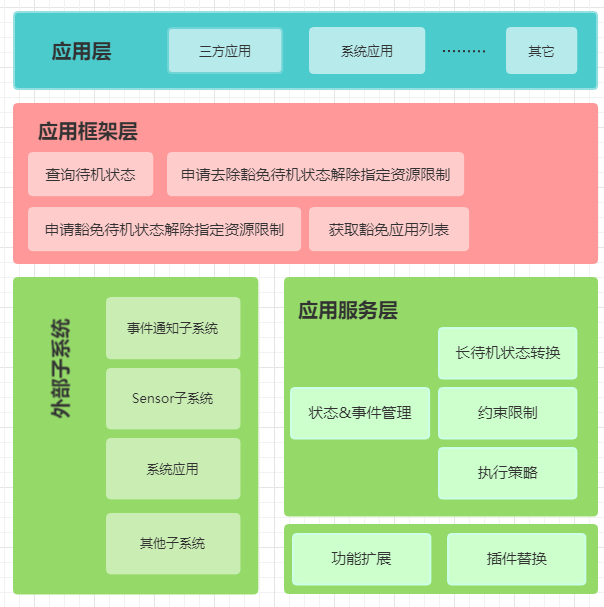

# 设备待机部件
## 简介<a name="section11660541593"></a>
为提高设备续航，降低设备功耗，在设备进入待机空闲状态时，系统会限制后台应用使用资源。开发者可以根据自身情况，为自己的应用申请纳入待机资源管控，或者暂时不被待机资源管控。

**图 1**  设备待机部件整体架构图



## 目录<a name="section161941989596"></a>

```
/foundation/resourceschedule/device_standby
├── frameworks       # 接口实现
├── interfaces
│   ├── innerkits    # 对内接口目录
│   └── kits         # 对外接口目录
├── sa_profile       # 组件服务配置
├── services         # 组件服务实现
└── utils            # 组件工具实现
└── plugins          # 插件（状态监控、决策、转换、执行）
└── bundle.json      # 部件描述及编译文件
```

### 部件内子模块职责说明<a name="section114564657874"></a>

|子模块名称   |功能职责描述    |
|------------|---------------|
|interface   |1.对外提供inner级别dump维测、豁免、通知接口。 |
|            |2.提供约束接口。 |
|sa_profile  |在服务管理中配置standby服务。|
|services    |1.内部核心服务功能实现。 |
|            |2.通知、查询功能。 |
|plugins     |1.状态监控。 |
|            |2.决策是否限制设备应用资源。| 
|            |3.转换设备状态。  |
|            |4.执行策略。|
|utils       |1.通用工具、日志实现。|
|            |2.相关配置读写。 |
|frameworks  |配置对外接口框架能力。|

## 设备待机管控<a name="section1312121216216"></a>

|接口名   |接口描述    |
|------------|---------------|
|function getExemptedApps(resourceTypes: number, callback: AsyncCallback<Array&lt;ExemptedAppInfo&gt;>): void; |获取进入待机模式的应用名单，使用Callback异步回调。 |
|function getExemptedApps(resourceTypes: number): Promise<Array&lt;ExemptedAppInfo&gt;>; |获取进入待机模式的应用名单，使用Promise异步回调。 |
|function requestExemptionResource(request: ResourceRequest): void; |应用订阅申请豁免，使应用临时不进入待机管控。|
|function releaseExemptionResource(request: ResourceRequest): void; |取消应用订阅申请豁免。|

## 使用说明<a name="section114564657874"></a>

当设备应用长时间未被使用或通过按键，本部件可以使设备应用进入待机模式。待机模式不影响应用使用，还可以延长电池续航时间。通过本模块接口，开发者可为应用申请或取消待机资源管控。使用时需先申请权限：ohos.permission.DEVICE_STANDBY_EXEMPTION。

### ResourceType

非待机应用资源枚举。

|名称   |值   |说明|
| ------------ | ------------ |--------------|
|NETWORK    |1   |网络访问资源|
|RUNNING_LOCK    |2   |cpu-runninglock资源|
|TIMER     |4   | timer任务资源|
|WORK_SCHEDULER     |8   | work任务资源|
|AUTO_SYNC      |16   | 自动同步的资源 |
|PUSH     |32   | pushkit资源|
|FREEZE       |64   | 冻结应用资源|

### ExemptedAppInfo 

豁免应用信息，未进入待机管控的应用信息。

|名称  |类型   | 必填   |说明   |
| ------------ | ------------ |------------ | ------------ |
|[resourceTypes](#resourcetype)   | number  | 是   |应用的资源类型   |
|name   |string   | 是   |  应用名  |
|duration   | number  | 是   | 豁免时长 |

### ResourceRequest

待机资源请求体。

|名称   |类型   | 必填   |说明   |
| ------------ | ------------ |------------| ------------ |
|[resourceTypes](#resourcetype)   | number  | 是   |应用的资源类型   |
|uid   | number  | 是   |应用uid   |
|name   |string   | 是   | 应用名称  |
|duration   | number  | 是   | 豁免时长 |
|reason   |string   | 是   |  申请原因  |

## 相关仓<a name="section1371113476307"></a>

资源调度子系统

[**resourceschedule_device_standby**](https://gitee.com/openharmony/resourceschedule_device_standby)

[resourceschedule_work_scheduler](https://gitee.com/openharmony/resourceschedule_work_scheduler)

[notification_ces_standard](https://gitee.com/openharmony/notification_ces_standard)

[appexecfwk_standard](https://gitee.com/openharmony/appexecfwk_standard)

[powermgr_battery_manager](https://gitee.com/openharmony/powermgr_battery_manager)

[resourceschedule_background_task_mgr](https://gitee.com/openharmony/resourceschedule_background_task_mgr)