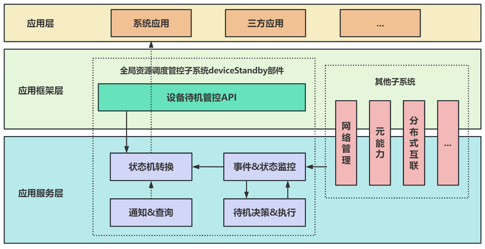

# 设备待机部件
## 简介
为提高设备续航，降低设备功耗，在设备进入待机空闲状态时，系统会限制后台应用使用资源。开发者可以根据自身情况，为自己的应用申请纳入待机资源管控，或者暂时不被待机资源管控。

## 系统架构

**图 1**  设备待机部件整体架构图


**图 2**  设备待机部件模块图


## 目录

```
/foundation/resourceschedule/device_standby
├── frameworks       # 接口实现
├── interfaces
│   ├── innerkits    # 对内接口目录
│   └── kits         # 对外接口目录
├── sa_profile       # 组件服务配置
├── services         # 组件服务实现
└── utils            # 组件工具实现
└── plugins          # 插件（状态监控、决策、转换、执行）
└── bundle.json      # 部件描述及编译文件
```

## 部件说明
本部件主要处理在系统正常工作（Active）与系统待机工作（Active->Standby）的状态转换。

**图 3**  整机状态变化过程


**图 4**  待机状态变化过程


三种典型场景说明：

**图 5**  手机开关机


**图 6**  PC开关机


**图 7**  车机开关机


## 开发步骤

	// 异步方法callback方式
	try{
    	deviceStandby.getExemptedApps(resourceTypes, (err, res) => {
       	 	if (err) {
           	 	console.log('DEVICE_STANDBY getExemptedApps callback failed. code is: ' + err.code + ',message is: ' + err.message);
        	} else {
            	console.log('DEVICE_STANDBY getExemptedApps callback success.');
        		for (let i = 0; i < res.length; i++) {
            		console.log('DEVICE_STANDBY getExemptedApps callback result ' + JSON.stringify(res[i]));
        		}
        	}
    	});
	} catch (error) {
    	console.log('DEVICE_STANDBY getExemptedApps throw error, code is: ' + error.code + ',message is: ' + error.message);
	}

3.申请豁免待机状态解除指定类型资源限制

	let resRequest = {
		resourceTypes: 1,
		uid:10003,
		name:"com.example.app",
		duration:10,
		reason:"apply",
	};
	// 异步方法promise方式
	try{
    	deviceStandby.requestExemptionResource(resRequest).then( () => {
        	console.log('DEVICE_STANDBY requestExemptionResource promise succeeded.');
    	}).catch( err => {
        	console.log('DEVICE_STANDBY requestExemptionResource promise failed. code is: ' + err.code + ',message is: ' + err.message);
    	});
	} catch (error) {
    	console.log('DEVICE_STANDBY requestExemptionResource throw error, code is: ' + error.code + ',message is: ' + error.message);
	}

	// 异步方法callback方式
	try{
    	deviceStandby.requestExemptionResource(resRequest, (err) => {
       	 	if (err) {
           	 	console.log('DEVICE_STANDBY requestExemptionResource callback failed. code is: ' + err.code + ',message is: ' + err.message);
        	} else {
            	console.log('DEVICE_STANDBY requestExemptionResource callback succeeded.');
        	}
    	});
	} catch (error) {
    	console.log('DEVICE_STANDBY requestExemptionResource throw error, code is: ' + error.code + ',message is: ' + error.message);
	}

4.申请去除豁免待机状态解除指定类型资源限制

	let resRequest = {
		resourceTypes: 1,
		uid:10003,
		name:"com.demo.app",
		duration:10,
		reason:"unapply",
	};
	// 异步方法promise方式
	try{
    	deviceStandby.releaseExemptionResource(resRequest).then( () => {
        	console.log('DEVICE_STANDBY releaseExemptionResource promise succeeded.');
    	}).catch( err => {
        	console.log('DEVICE_STANDBY releaseExemptionResource promise failed. code is: ' + err.code + ',message is: ' + err.message);
    	});
	} catch (error) {
    	console.log('DEVICE_STANDBY releaseExemptionResource throw error, code is: ' + error.code + ',message is: ' + error.message);
	}

	// 异步方法callback方式
	try{
    	deviceStandby.releaseExemptionResource(resRequest, (err) => {
       	 	if (err) {
           	 	console.log('DEVICE_STANDBY releaseExemptionResource callback failed. code is: ' + err.code + ',message is: ' + err.message);
        	} else {
            	console.log('DEVICE_STANDBY releaseExemptionResource callback succeeded.');
        	}
    	});
	} catch (error) {
    	console.log('DEVICE_STANDBY releaseExemptionResource throw error, code is: ' + error.code + ',message is: ' + error.message);
	}


